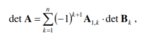

# Matrix_Determinant
Calculating the determinant of matrix using the method of decomposition by 1 line

*Task:*

User chooses whether to enter data in the console or specify the path to the file.
Matrix must be square. 

Calculate the value of the determinant of the entered matrix, using the method of decomposition on the first line,
where the sub matrix Bk is obtained from the matrix A by removing the first row and k-th column.